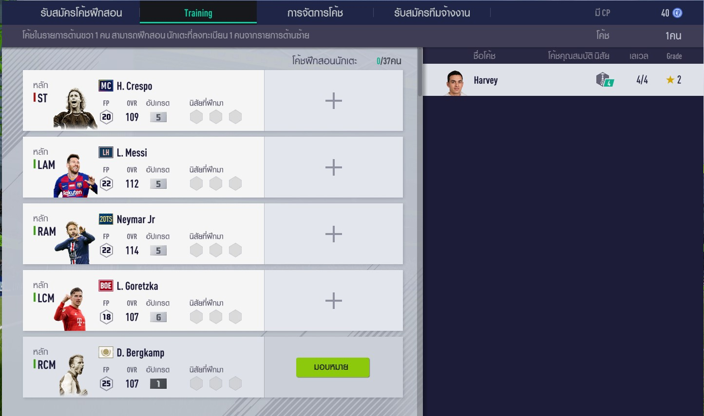

# FO4 Coach System Guide
A simple guide for the coach system in FIFA Online 4

## Basics
The coaching system in FO4 provides ways to add traits to your starting 11 with a maximum of 3 per player. Coaches are graded from 1 - 5 stars which affects the maximum level of the trait the coach will provide.

This is the main screen that will greet you once entering the coaching system menu. We will go through each tab of this system in the following sections

### 1. Recruitment

This is where you can recruit coaches for your squads with a maximum of 6 coaches available to be picked up and re-rolled based on the number and level of your headhunters.

This section is fairly simple with the 50CP button on the bottom right being the re-roll button while the button enclosed within the scouted coach's box is the cost of hiring the coach. The cost of hiring a coach increases based on the star rating.

### 2. Training

This section allows you to assign each coach to a player on your team. Each coach can be assigned to only one player. Just click on the coach and the green button next to the player to complete the assignment.

### 3. Management

The management section allows you to promote, develop or fire a coach. Coaches will always start with their assigned traits at level 1 and can be raised to a maximum level based on the coach's grade. To increase the level, click on the develop button and add levels by using both BP and CP to whichever trait accordingly. Once a coach is fully maxed out on trait levels, they can be then promoted to a headhunter to scout for higher tier coaches in the recruitment page.

### 4. Headhunters

Finally, the headhunters section will hold all promoted coaches and have them be available to scout for higher tier coaches for recruitment. Unassigned headhunters will be placed at the bottom bar and clicking on them followed by the green button as shown in the image will assign them to scouting teams. You can have a maximum of 3 scouting teams consisting of 3 headhunters each. The green triangle represents the level of the coach and scouting team where higher levels results in better coaches being available for recruitment.